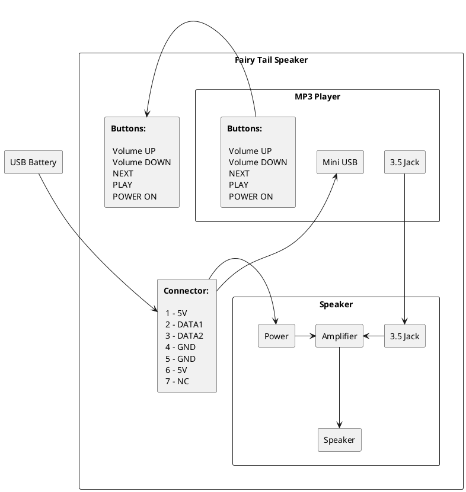

*Last update on 25/04/2020*

# Recycle MP3 Player 

## Introduction

This page describes an idea how to recycle an old MP3 player. 

I had an MP3 player with broken screen and also a low quality 
speaker from a low cost market. So, I decided to reuse 
both of them and to make a Fairy Tail Speaker 
for my daughter. It could be a good alternative to musical 
books or children musical phones. 

What I needed:

- MP3 player
  
- speeker
  
- USB cable 
  
- several push buttons
  
- 7-pin connector
  
- USB battery (optionnal)

## Put Things Together

The idea is very simple: 

- put the things together
  
- add some buttons to be able to navigate between stories
  
- add a connector for supply and for MP3 download

The diagram of connections:

Inside of my Old MP3 player:

 

I soldered buttons and fixed them to the speaker case:

 

The 7-pin connector which I use in every DIY project. I cut a mini USB cable on two parts: one part goes from an USB battery to the connector, another one goes from the connector to the player:

 

I added some stickers to reconize the commands:

 

And the final look after a month of use:

 

## Conclusion

So, the Fairy Tail Speaker works! I download up to 10 stories at the same time to facilitate navigation by buttons. 

I won also a Li-ion battery from the MP3 player which 
can be reused in another DIY project.
